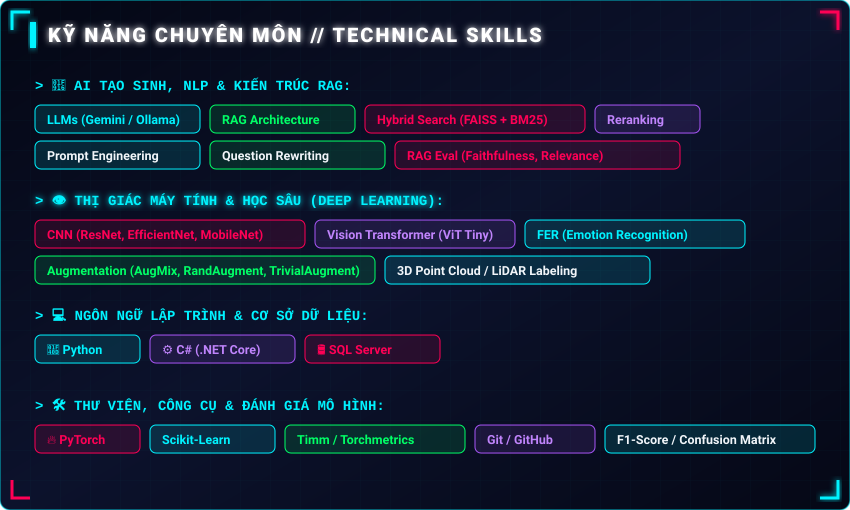

  <!-- Futuristic Cyber HUD Hologram Reveal Header with Integrated Sci-Fi Background -->
  

  <!-- Local Animated Cyber Terminal Typing Banner -->
  

  <!-- Status Badges -->
  
  
  
  

 

<!-- Futuristic Vector Profile Dossier Card -->

  

 

<!-- Futuristic Vector Technical Skills Card -->

  

 

<!-- Futuristic Vector Soft Skills Card -->

  

 

  

