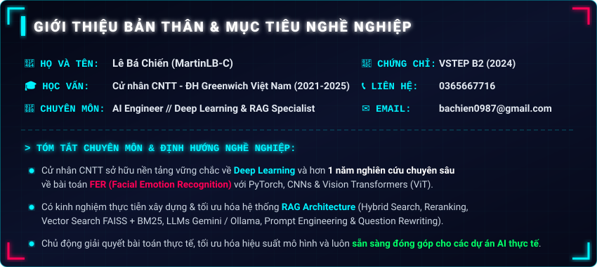
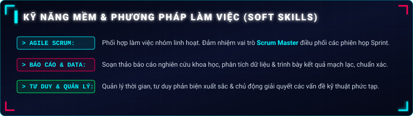

  <!-- Futuristic Cyber HUD Hologram Reveal Header -->
  

  <!-- Dynamic Terminal Typing Banner -->
  

  <!-- Status Badges -->
  
  
  
  

 

<!-- Futuristic Vector Profile Dossier Card (Replaces plain code block) -->

  

 

<h2 align="center">
   
  KỸ NĂNG CHUYÊN MÔN // TECHNICAL SKILLS
</h2>

  <strong>🤖 AI Tạo sinh, NLP &amp; Kiến trúc RAG</strong> 
  
  
  
  
  
  

  <strong>👁️ Thị giác Máy tính &amp; Học sâu (Deep Learning)</strong> 
  
  
  
  
  

  <strong>💻 Ngôn ngữ Lập trình &amp; Cơ sở Dữ liệu</strong> 
  
  
  

  <strong>🛠️ Thư viện, Công cụ &amp; Đánh giá Mô hình</strong> 
  
  
  
  
  

 

<!-- Futuristic Vector Soft Skills Card (Replaces plain code block) -->

  

 

<h2 align="center">
   
  TRÌNH ĐỘ HỌC VẤN &amp; CHỨNG CHỈ
</h2>

  <table width="90%">
    <thead>
      <tr stroke="#00f3ff">
        <th align="left">🎓 Bằng cấp / Chứng chỉ</th>
        <th align="left">🏛️ Trường / Tổ chức cấp</th>
        <th align="center">⏳ Thời gian / Xếp loại</th>
      </tr>
    </thead>
    <tbody>
      <tr>
        <td><b>Cử nhân Công nghệ Thông tin</b></td>
        <td>Đại học Greenwich (Việt Nam)</td>
        <td align="center"><b>2021 - 2025</b> | Xếp loại Khá - Giỏi</td>
      </tr>
      <tr>
        <td><b>Chứng chỉ Tiếng Anh VSTEP B2</b></td>
        <td>Bộ Giáo dục &amp; Đào tạo</td>
        <td align="center"><b>Năm 2024</b></td>
      </tr>
    </tbody>
  </table>

 

<h2 align="center">
  
  THÔNG TIN LIÊN HỆ // CONTACT ME
</h2>

  
  
  

 

  

